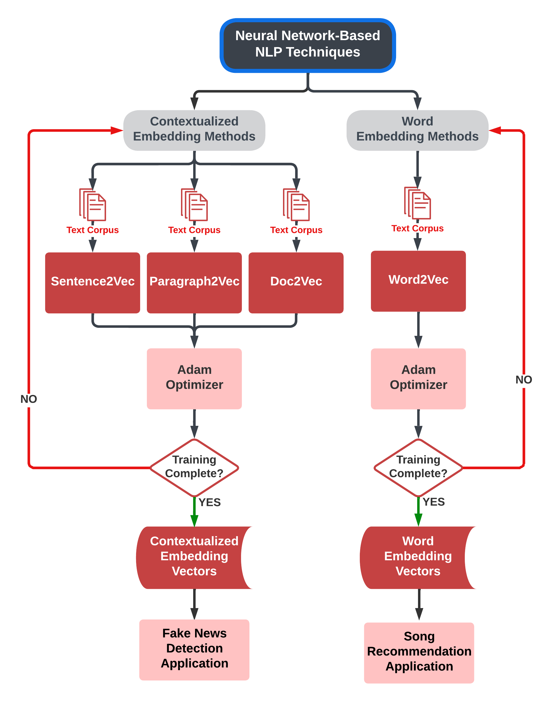

# VisNLP 2.0: A Visual-Based Educational Support Platform for Teaching and Learning Neural Network-Based NLP Analytics

## Contributors
Jack Gomes, Daniel Johnson, Garrett McMerriman, John Prominski, Henry Yoder

Worcester Polytechnic Institute, 2023.

## Abstract
Natural Language Processing (NLP) has become increasingly relevant in our data-driven world and is being implemented widely today due to the abundance of natural language data. However, mastering NLP processes is not a simple task, particularly for those without a comprehensive background in the field. Further, the use of neural networks in many commonly used NLP approaches makes it difficult to interpret the input-output relationships of these models, creating the "black-box" problem in data science. To address these challenges, we develop and implement a web-based interactive visual NLP learning platform that enables learners to study some fundamental neural network-based NLP techniques, topics, and applications. Specifically, the technical contribution of this work is threefold: (1) To present popular neural network-based NLP analytics methods in a step-by-step linear format that is easy to comprehend. (2) To eliminate the 'black box' problem found in neural network-based NLP learning resources by providing continuous real-data examples. (3) To enable users to interpret model outputs through interactive visual demos that apply neural network-based NLP method outputs.

## Web Module Relational Diagram

## Project Credits
This project is part of a Major Qualifying Project submitted to the faculty of Worcester Polytechnic Institute in partial fulfillment of the requirements for the Degrees of Bachelor of Science in Computer Science and Data Science.

**Created By:** Jack Gomes (DS), Daniel Johnson (DS), Garrett McMerriman (DS), John Prominski (CS), Henry Yoder (CS)

**Advised By:** Professor Chun-Kit Ngan, WPI (DS)

